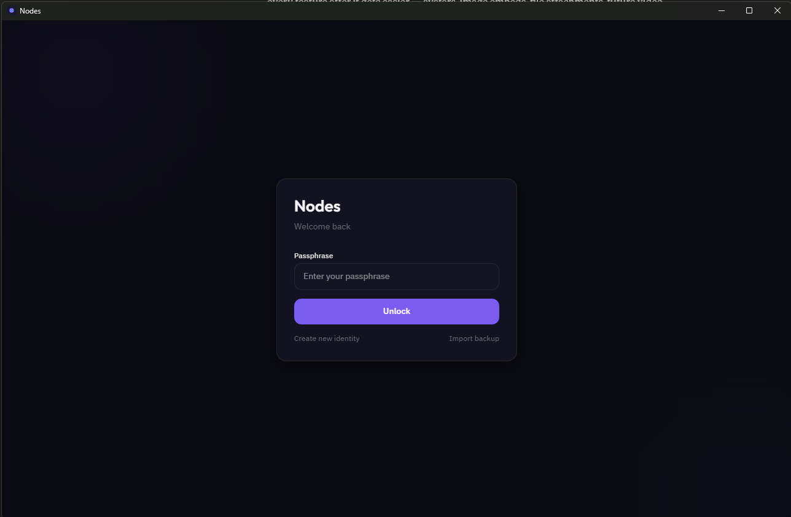
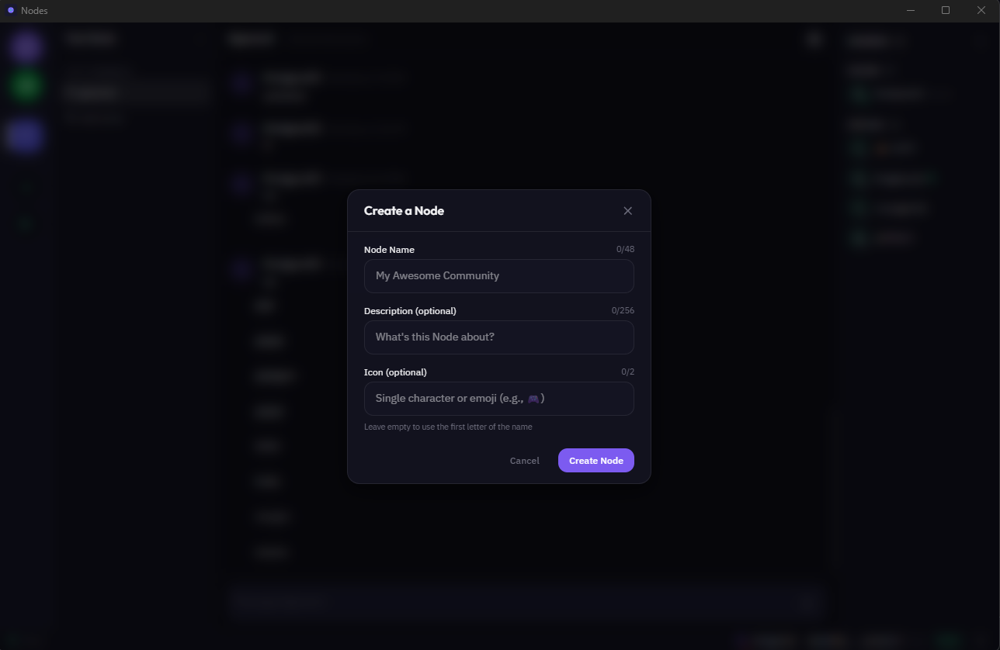

# Nodes

**Open-source, decentralized Discord alternative where users own and serve their own identity — no servers, no corporate middlemen, just math.**

---

Your identity is a cryptographic keypair generated on your device. Your profile data lives in your own graph, signed by your keys, served peer-to-peer. Messages sync in real-time without central servers. DMs are end-to-end encrypted — not even relay peers can read them. Nobody owns your data because nobody has it but you.

## Why Nodes?

Discord now requires government ID verification. Their 2025 data breach exposed tens of thousands of government IDs submitted for age verification. Users are being asked to hand over more personal data to a platform that already proved it can't protect what it has.

Nodes takes a different approach: **there's nothing to breach because there's nothing to store.** Identity is cryptography, not a database row. Communication is peer-to-peer, not routed through corporate infrastructure. Privacy isn't a policy — it's architecture.

## What Works Today (v1.0.0-beta)

- **Self-sovereign identity** — Keypair-based identity with encrypted local keystore and backup/restore
- **Community Nodes** — Create or join communities with invite links, text channels, and member management
- **Real-time messaging** — P2P text chat with message grouping, timestamps, history, and typing indicators
- **E2E encrypted DMs** — ECDH key exchange, messages encrypted before they touch the network
- **Friend system** — Request/accept flow gates all DMs — no unsolicited messages
- **Voice channels** — P2P WebRTC voice chat with speaking indicators, mute/deafen controls, LiveKit SFU for 7+ participants
- **File sharing** — Drag-and-drop uploads via IPFS, inline image previews, clipboard paste (Ctrl+V)
- **Avatars** — Profile pictures uploaded to IPFS with server pinning for cross-client reliability
- **GIF picker** — Giphy integration with trending and search, inline GIF rendering
- **Emoji picker** — Full emoji picker with categories, search, skin tones, and recent emojis
- **Emoji reactions** — React to messages with any emoji, syncs P2P in real-time
- **Reply/quote** — Reply to specific messages with clickable quote references
- **Markdown rendering** — Bold, italic, code, code blocks with syntax highlighting, links, blockquotes, lists
- **Link previews** — OpenGraph metadata cards for URLs, special YouTube embeds with thumbnails
- **Message editing** — Edit your own messages with "(edited)" indicator and history
- **Message deletion** — Soft-delete your own messages, displays "[Message deleted]"
- **@Mentions & Notifications** — @user, @role, @everyone, @here with autocomplete, desktop notifications, per-channel/Node settings
- **Roles & permissions** — Customizable roles with colors, hierarchy, and granular permissions
- **Moderation tools** — Kick/ban members, slow mode for channels, moderation audit log in settings
- **Full-text search** — Global search overlay (Ctrl+K), search across all messages and DMs with filters
- **Node Discovery** — Browse and join public communities from a decentralized directory, no invite link needed
- **Theming** — 7 built-in themes (Dark, Light, OLED Black, Midnight Blue, Forest, Sunset, Cyberpunk), custom theme creator, accent colors, font sizes, compact mode, per-Node themes, import/export
- **Presence** — Online/idle/DND/invisible status with heartbeat
- **Profile system** — Editable profiles with per-field visibility controls (public/friends/nobody)
- **Desktop app** — Native Tauri binary with system tray (~15MB, ~80MB RAM)

## Screenshots




## Download

| Platform | Download |
|----------|----------|
| Windows (MSI) | [Nodes_1.0.0_x64_en-US.msi](https://github.com/Leveq/Nodes/releases/latest) |
| Windows (NSIS) | [Nodes_1.0.0_x64-setup.exe](https://github.com/Leveq/Nodes/releases/latest) |
| Linux (AppImage) | [Nodes_1.0.0_amd64.AppImage](https://github.com/Leveq/Nodes/releases/latest) |
| Linux (deb) | [Nodes_1.0.0_amd64.deb](https://github.com/Leveq/Nodes/releases/latest) |
| Linux (rpm) | [Nodes-1.0.0-1.x86_64.rpm](https://github.com/Leveq/Nodes/releases/latest) |
| macOS (Apple Silicon) | [Nodes_1.0.0_aarch64.dmg](https://github.com/Leveq/Nodes/releases/latest) |
| macOS (Intel) | [Nodes_1.0.0_x64.dmg](https://github.com/Leveq/Nodes/releases/latest) |

Or use the web client at [app.nodes.services](https://app.nodes.services).

## Architecture

| Layer | Technology | Purpose |
|-------|-----------|---------|
| Desktop | Tauri v2 (Rust) + React 19 + TypeScript | Native app, ~15MB binary |
| P2P Data | GunJS + SEA | Real-time sync, cryptographic auth |
| Identity | Self-Sovereign (SSI) | Users serve their own profile via keypair |
| Encryption | SEA (ECDSA + ECDH + AES-256) | Signing, key exchange, E2E encryption |
| Voice | WebRTC (P2P mesh) + LiveKit SFU | Real-time voice chat (mesh ≤6, SFU 7+) |
| File Storage | IPFS (Helia + Kubo gateway) | Decentralized file sharing with server pinning |

**Transport Abstraction Layer:** The app never touches GunJS directly. All P2P operations go through protocol-agnostic interfaces, so the underlying transport can be swapped without rewriting the UI or business logic.

## Getting Started

### Prerequisites

- [Node.js](https://nodejs.org/) 18+
- [pnpm](https://pnpm.io/) 8+
- [Rust](https://rustup.rs/) (for Tauri)

### Development

```bash
# Clone
git clone https://github.com/Leveq/Nodes.git
cd Nodes

# Install dependencies
pnpm install

# Run desktop app in development
pnpm dev

# Build for production
pnpm tauri build

# Run tests
pnpm test

# Lint & format
pnpm lint
pnpm format
```

## Project Structure

```
nodes/
├── apps/
│   └── desktop/              # Tauri v2 desktop app
│       ├── src/              # React frontend
│       │   ├── components/   # UI components
│       │   ├── hooks/        # Subscription & utility hooks
│       │   ├── stores/       # Zustand state management
│       │   ├── services/     # Avatar, notification, theme, search managers
│       │   ├── layouts/      # App shell, sidebars
│       │   └── styles/       # Global CSS, theme variables
│       └── src-tauri/        # Rust backend (system tray, commands)
├── packages/
│   ├── core/                 # Shared types, constants, built-in themes
│   ├── transport/            # Transport abstraction layer (interfaces)
│   ├── transport-gun/        # GunJS adapter (messaging, presence, profiles, nodes, DMs, moderation, IPFS, directory)
│   ├── crypto/               # Key management, profile encryption, DM encryption
│   └── ui/                   # Shared React components
├── infrastructure/           # Docker Compose, nginx, relay configs
│   ├── docker-compose.yml    # Gun relay + LiveKit + TURN + IPFS
│   └── nginx/                # Reverse proxy config
└── scripts/                  # Build & deploy utilities
```

## Infrastructure

Nodes uses relay infrastructure for message persistence, voice, and file availability:

| Service | Purpose |
|---------|---------|
| Gun Relay | Message persistence and P2P sync |
| LiveKit | Voice SFU for 7+ participants |
| TURN Server | WebRTC NAT traversal |
| IPFS (Kubo) | File pinning and HTTP gateway |
| Nginx | Reverse proxy + TLS termination |

All services run via Docker Compose. See `infrastructure/` for deployment configs.

## Roadmap

### Phase 1 — Foundation ✅
Identity, messaging, communities, DMs, friends, presence, profiles, desktop app.

### Phase 2 — Competitive Features ✅
- ✅ File sharing (IPFS) — Milestone 2.1
- ✅ Message reactions, replies, markdown, link previews, editing, deletion — Milestone 2.2
- ✅ Roles & permissions — Milestone 2.3
- ✅ Voice channels (P2P WebRTC) — Milestone 2.4
- ✅ Moderation tools (kick, ban, slow mode) — Milestone 2.5

### Phase 3 — Platform Expansion ✅
- ✅ Full-text search — Milestone 3.1
- ✅ Node Discovery — Milestone 3.2
- ✅ Notifications & @Mentions — Milestone 3.3
- ✅ Theming — Milestone 3.4
- ✅ Media polish (avatars, GIFs, emoji picker, clipboard paste) — Milestone 3.5a
- ✅ Polish pass & production release — Milestone 3.5

### Phase 4 — Scale
- 🔲 Auto-updater (in-app update notifications)
- 🔲 Mobile app (React Native)
- 🔲 Linux & macOS desktop builds
- 🔲 Plugin/bot system
- 🔲 Encrypted channels
- 🔲 Web PWA

## How It's Different

| | Discord | Matrix/Element | Nodes |
|---|---------|---------------|-------|
| Identity | Email + phone + gov ID | Email + homeserver | Cryptographic keypair (no PII) |
| Data ownership | Discord owns everything | Homeserver admin owns it | **You own it** |
| Encryption | None (channels), partial (DMs) | Optional E2E | **E2E by default (DMs)** |
| Infrastructure | Centralized servers | Federated servers | **Peer-to-peer** |
| Cost to run | Free (you are the product) | Server hosting costs | **$0 — users are the network** |
| Bans | Platform can erase your identity | Server admin can ban | **Node bans don't delete your identity** |

## Known Limitations (Beta)

- **No mobile app yet.** Desktop and web only for now.
- **No E2E encrypted channels.** Only DMs are encrypted. Channel messages are signed but not encrypted.
- **No push notifications on web.** Desktop notifications require the Tauri app.
- **Back up your identity keypair.** There is no password recovery — if you lose your keys, your identity is gone.
- **No message history beyond what relays persist.** If all relays drop a message before you sync, it's gone.
- **DM metadata is visible.** Who talks to whom and when is observable in the Gun graph. Message content is encrypted.
- **Single relay dependency.** While the protocol is decentralized, the current deployment uses a single relay server. Running your own relay mitigates this.

## Contributing

Nodes is in beta. If you're interested in contributing, open an issue to discuss before submitting a PR. Areas where help is most needed:

- Mobile app (React Native)
- Linux and macOS desktop builds
- Auto-updater implementation
- Automated test coverage
- UI/UX design and polish
- Security auditing
- Documentation

## License

[AGPL-3.0](LICENSE) — You're free to use, modify, and distribute Nodes. If you deploy a modified version, you must share your changes under the same license.

---

*Communication should be decentralized, encrypted, and owned by the people who use it.*